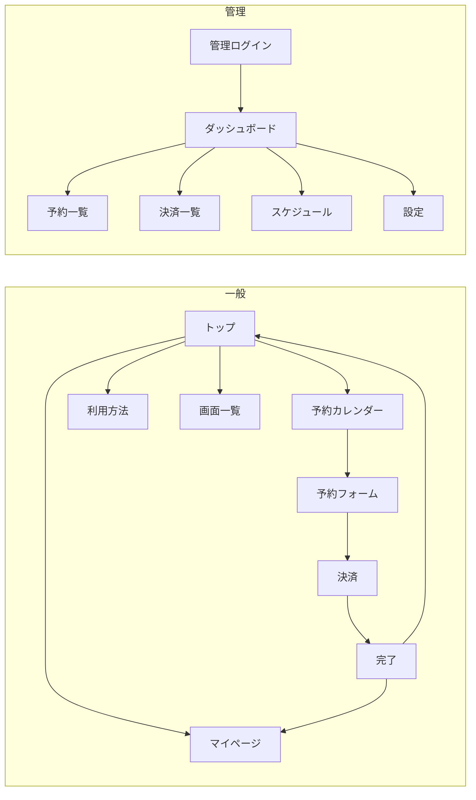
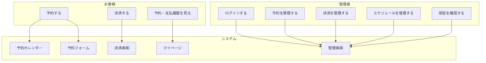
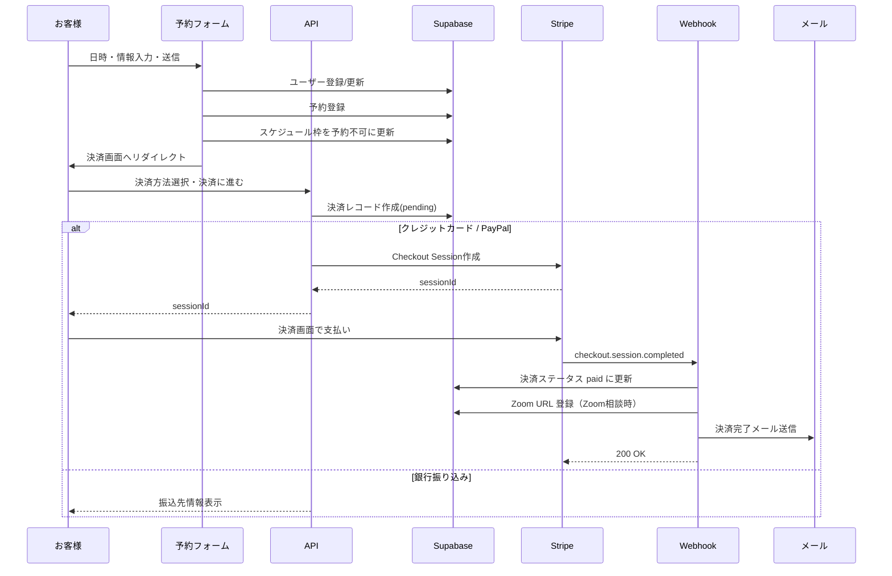
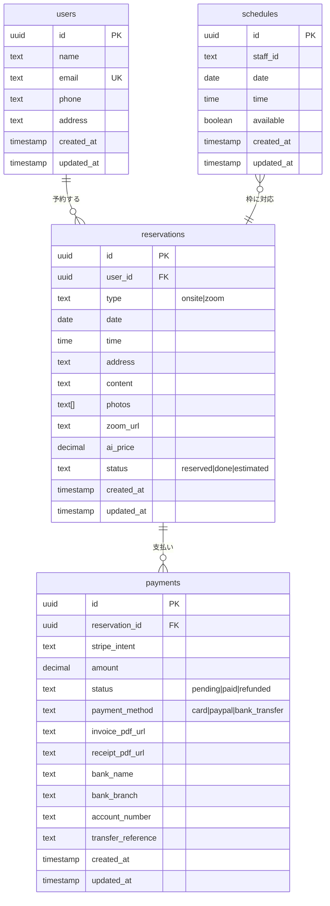

# 現地調査予約サイト 要件定義書

株式会社COLORS 向け リフォーム・塗装の現地調査予約・決済・管理システム

---

## 1. システム概要

### 1.1 目的
福岡市を中心に、リフォーム・塗装の現地調査を24時間オンラインで予約でき、決済・Zoom相談・管理まで一括で行うWebシステムを提供する。

### 1.2 システム構成図（Mermaid）

```mermaid
flowchart TB
    subgraph クライアント
        A[トップページ]
        B[予約カレンダー]
        C[予約フォーム]
        D[決済画面]
        E[予約完了]
        F[マイページ]
        G[管理画面]
    end

    subgraph API
        API1[/api/checkout]
        API2[/api/webhook/stripe]
        API3[/api/email/send]
        API4[/api/ai/estimate]
        API5[/api/admin/login]
        API6[/api/payment/bank-transfer]
    end

    subgraph 外部サービス
        DB[(Supabase)]
        Stripe[Stripe]
        SMTP[メール送信]
    end

    A --> B --> C --> D --> E
    C --> API4
    D --> API1
    API1 --> Stripe
    Stripe --> API2
    API2 --> DB
    API2 --> API3
    API3 --> SMTP
    G --> API5
    D --> API6
    API1 --> DB
```

### 1.3 ユーザー種別

| 種別 | 説明 |
|------|------|
| 一般ユーザー（お客様） | 予約・決済・マイページの利用 |
| 管理者 | 管理画面で予約・決済・スケジュール・設定の管理 |

---

## 2. 機能要件

### 2.1 お客様向け機能

| No | 機能名 | 説明 |
|----|--------|------|
| F1 | 予約カレンダー | 空き枠の日付・時間を表示し、希望日時を選択する |
| F2 | 予約フォーム | 氏名・メール・電話・住所・相談内容・写真アップロード・訪問/Zoom選択を入力 |
| F3 | AI概算 | 住所・相談内容から概算金額・作業時間の目安を取得（任意） |
| F4 | 決済 | クレジットカード / PayPal / 銀行振り込みから選択し決済 |
| F5 | 予約完了 | 決済完了後の確認画面・Zoom URL表示 |
| F6 | マイページ | 予約履歴・支払履歴の確認（メールベースの簡易識別） |

### 2.2 管理画面機能

| No | 機能名 | 説明 |
|----|--------|------|
| M1 | ログイン | パスワード認証（環境変数で設定） |
| M2 | ダッシュボード | 今日の予約数・今週の予約数・入金待ち・完了件数の表示 |
| M3 | 予約管理 | 予約一覧・詳細・ステータス更新（予約済み/見積済み/完了） |
| M4 | 決済管理 | 決済一覧・ステータス更新（入金待ち/入金済み/返金済み） |
| M5 | スケジュール管理 | 週表示で空き枠の登録・有効/無効の切り替え（火・水・木営業） |
| M6 | 設定 | 管理者メール・SMTP・営業日・営業時間の表示（環境変数連携） |

### 2.4 非機能要件

- 予約は24時間受付可能（カレンダー・フォームは常時公開）
- 決済はStripe経由でクレジットカード・PayPal対応
- メールはSMTP（Xserver等）で送信
- 認証：お客様はメール単位の簡易識別、管理者はパスワードのみ

---

## 3. 画面遷移図（Mermaid）



---

## 4. ユースケース図（Mermaid）



---

## 5. 予約〜決済 シーケンス図（Mermaid）



---

## 6. データベース ER 図（Mermaid）



---

## 7. 管理画面ログイン情報

### 7.1 ログインURL
- 本番: `https://（あなたのドメイン）/admin/login`
- ローカル: `http://localhost:7000/admin/login`

### 7.2 認証方式
- **パスワードのみ**（ユーザーIDはなし）
- 環境変数で設定したパスワードと一致すればログイン成功

### 7.3 パスワードの設定方法

| 環境変数 | 優先度 | 説明 |
|----------|--------|------|
| `ADMIN_PASSWORD` | 1（最優先） | 管理画面用パスワード（サーバー側のみ。推奨） |
| `NEXT_PUBLIC_ADMIN_PASSWORD` | 2 | 管理画面用パスワード（クライアントに露出するため非推奨） |
| 未設定時 | 3 | **デフォルト: `admin123`** |

### 7.4 設定例（.env.local）

```env
# 管理画面ログイン（本番では必ず変更すること）
ADMIN_PASSWORD=あなたの強力なパスワード
```

### 7.5 ログイン後の保持
- ログイン成功時、`sessionStorage` に `admin_logged_in = true` を保存
- ブラウザを閉じるまで有効（閉じると再ログイン必要）
- ログアウト時は「ログアウト」ボタンで `admin_logged_in` を削除

### 7.6 セキュリティ上の注意
- 本番環境では **必ず** `ADMIN_PASSWORD` を強力なパスワードに変更すること
- `NEXT_PUBLIC_` 付きの変数はクライアントに送られるため、管理パスワードには使わないこと
- デフォルトの `admin123` は開発・検証用であり、本番では使用しないこと

---

## 8. インフラ・外部連携

```mermaid
flowchart LR
    subgraph アプリ
        Next[Next.js]
    end

    subgraph データ・ストレージ
        Supabase[(Supabase\nDB + Storage)]
    end

    subgraph 決済
        Stripe[Stripe]
    end

    subgraph メール
        SMTP[SMTP\nXserver等]
    end

    Next --> Supabase
    Next --> Stripe
    Next --> SMTP
    Stripe -->|Webhook| Next
```

| 項目 | 内容 |
|------|------|
| ホスティング | Vercel 想定 |
| DB | Supabase (PostgreSQL) |
| 決済 | Stripe（カード・PayPal・銀行振込は自前表示） |
| メール | SMTP（環境変数でホスト・認証を指定） |
| 画像保存 | Supabase Storage（photos バケット） |

---

## 9. 用語集

| 用語 | 説明 |
|------|------|
| 現地調査 | リフォーム・塗装のため、スタッフが訪問して行う調査・ヒアリング |
| 訪問調査 | 現地にスタッフが赴く予約タイプ |
| Zoom相談 | オンラインで行う相談の予約タイプ |
| 予約金 | 決済画面で支払う金額（ai_price またはデフォルト1万円） |
| 画面一覧 | ローカルで全画面をモック表示するための入口（/view） |

---

## 10. 改訂履歴

| 版 | 日付 | 内容 |
|----|------|------|
| 1.0 | 2026-01 | 初版作成 |
